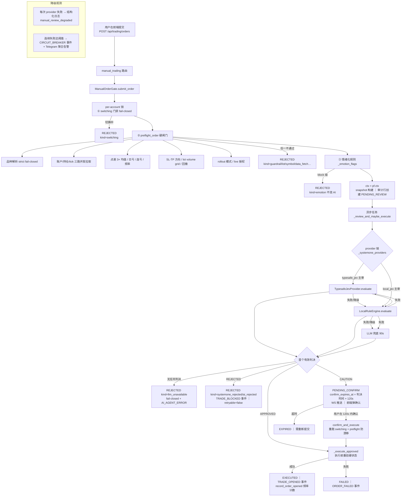
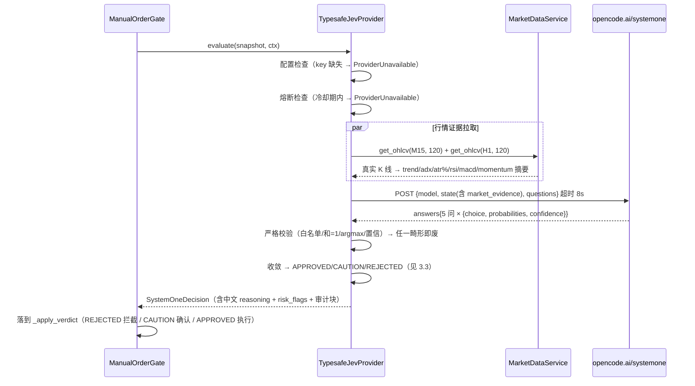

# JEV 集成文档：请求/响应协议 + 手动单全流程

> 本文档是 JEV（TypeSafe System One）在**手动交易风控审查**中的技术参考：
> 外部 API 的请求/响应字段级说明、严格校验、判决收敛规则，以及它在前端提交 →
> 硬闸门 → 审查 → 确认/执行整条链路中的位置与详细流程。
> 使用/配置速查见 [MANUAL-REVIEW-JEV-GUIDE.md](./MANUAL-REVIEW-JEV-GUIDE.md)；
> 真实数据实测报告见 `.planning/2026-09-27-jev/jev-realdata-report.md`。

---

## 1. 总览：JEV 在手动单流程中的位置

```
用户点"提交" → 硬闸门（确定性防火墙，先于一切 AI）→ JEV 审查（1~2 秒）
             → 本地规则引擎（毫秒级，JEV 失败时接管）→ LLM（90 秒兜底）
             → APPROVED 直接执行 / CAUTION 人工二次确认 / REJECTED 拦截
```

**firewall 顶层不变式**：
- 硬闸门只能被后续审查层**收紧**、绝不放松；REJECTED 不可覆写；
- 审查层顺序：`typesafe_jev（外部 JEV API）→ local_jev（本地确定性规则）→ LLM`；
- 任何一层失败沿链降级；**全链失败 = 拒单（fail-closed）**；
- 凡是能进「二次确认」的（CAUTION），说明至少有一层 AI 认为"倾向放行但把握不足"。

---

## 2. 外部 JEV API 协议（请求）

### 2.1 端点与鉴权

| 项 | 值 |
|---|---|
| Method / URL | `POST https://opencode.ai/zen/v1/systemone`（base_url 配置可换，若不以 `/systemone` 结尾自动拼接） |
| 请求头 | `Authorization: Bearer <MANUAL_REVIEW_TYPESAFE_API_KEY>`、`Content-Type: application/json` |
| 超时 | `MANUAL_REVIEW_TYPESAFE_TIMEOUT_S`（默认 8 秒，只包 JEV 段） |
| 代理 | `MANUAL_REVIEW_TYPESAFE_PROXY_URL`（空 = 直连） |

### 2.2 请求体（JSON）

```jsonc
{
  "model": "jev-1.13-free",                       // MANUAL_REVIEW_TYPESAFE_MODEL
  "state": { /* 见 2.3，全部来自本次手动单的真实上下文 */ },
  "questions": { /* 见 2.4，5 道固定选择题定义（原样下发） */ }
}
```

### 2.3 `state` 字段（手动单语境）

**顶层字段**：

| 字段 | 来源 | 说明 |
|---|---|---|
| `source_type` | 固定 | `"manual"` |
| `symbol` | ctx.symbol | 规范品种名（如 `GOLD`） |
| `action` | 订单方向 | `"buy"` / `"sell"`（order_type 以 BUY/SELL 前缀判定） |
| `market_type` | 固定 | `"cfd"` |
| `order_type` | 订单 | 原始类型：`BUY`/`SELL`/`BUY_LIMIT`/`SELL_LIMIT`/`BUY_STOP`/`SELL_STOP` |
| `quantity` | ctx.lot | 手数（volume grid 归一后） |
| `reference_price` | ctx.entry_ref | 市价单=tick 中间价；挂单=挂单价 |
| `notional` | 计算 | `reference_price × quantity` |
| `leverage` | 账户 | bridge /account 有 `leverage` 字段才带，否则 1.0 |
| `strategy_type` | 固定 | `"manual"` |
| `signal_reason` | 固定 | `"manual order request"` |

**`context` 子对象**：

| 字段 | 来源 | 说明 |
|---|---|---|
| `sl` / `tp` | 订单 | 止损/止盈价（0 = 无） |
| `spread` | tick | ask − bid |
| `account` | 真实账户快照 | `balance/equity/profit/margin`（MT5 实时值） |
| `positions` | 真实持仓 | `[{symbol, type, lot, profit}]`，最多 20 条 |
| `recent_trades` | 真实成交 | 近 10 笔成交原文（`symbol/type/lot/profit/time/comment`…） |
| `rule_flags` | 情绪规则层 | 硬闸门之后、审查之前的情绪化交易标记（revenge/martingale/loss_streak…） |
| `market` | snapshot | `{bid, ask, spread, sentiment}`（sentiment 来自 Redis，可为空） |
| `market_evidence` | **实时行情证据** | M15/H1 各一组的指标摘要，见下表 |

**`market_evidence`（M15/H1 各一组，T={M15,H1}）**：

```jsonc
"market_evidence": {
  "m15": { "tf": "M15", "available": true, "trend": 1, "adx": 51.5,
           "atr_pct": 0.142, "rsi": 42.5, "macd_hist": -1.915,
           "momentum_pct": -0.8, "last_close": 4188.23, "bars": 120 },
  "h1":  { /* 同结构 */ }
}
```

> 证据拉取失败/未注入时不携带该字段（`{}`）——模型会判 `执行质量=不足/低置信`，
> 属预期降级路径，不抛错。

### 2.4 `questions`（5 道固定选择题，随请求原样下发）

| 问题名 | 含义 | 选项（options） |
|---|---|---|
| `data_quality` | 证据是否足以做交易前决策 | `sufficient` 充分 / `partial` 部分可用 / `insufficient` 不足 |
| `signal_alignment` | 请求方向与市场证据是否一致 | `aligned` 一致 / `mixed` 分歧 / `conflict` 冲突 / `insufficient` 不足 |
| `market_regime` | 当前市场状态是否适合该入场 | `favorable` 有利 / `neutral` 中性 / `adverse` 不利 / `insufficient` 不足 |
| `risk_check` | 仓位/杠杆/敞口/回撤/近期表现/保护 | `clear` 通过 / `caution` 谨慎 / `block` 阻断 / `insufficient` 不足 |
| `execution_quality` | 价格新鲜度/偏离/订单类型/点差/约束 | `clear` 通过 / `caution` 谨慎 / `block` 阻断 / `insufficient` 不足 |

每题的 `instructions` + 每个选项的 `criteria` 定义在 `backend/app/services/typesafe_jev.py::JEV_QUESTIONS`（QuantDinger 同源，人工单语境微调）。

---

## 3. 响应协议与严格校验

### 3.1 响应体（JSON）

```jsonc
{
  "answers": {                       // 或 result / data（三种键兼容）
    "data_quality": {
      "type": "choice",
      "choice": "partial",           // 命中的选项
      "confidence": 0.45,            // [0,1]，可缺省 → 兜底取 probabilities[choice]
      "probabilities": { "sufficient": 0.34, "partial": 0.63, "insufficient": 0.03 }
    },
    "signal_alignment": { /* 同结构 */ },
    "market_regime":    { /* 同结构 */ },
    "risk_check":       { /* 同结构 */ },
    "execution_quality":{ /* 同结构 */ }
  }
}
```

### 3.2 严格校验（任一不满足 → 该次应答作废 → 沿链降级，绝不采用）

| 校验 | 规则 |
|---|---|
| 选项白名单 | `choice` 必须 ∈ 该问题的 options |
| 概率完备 | `probabilities` 的键集合 == options（缺一即废） |
| 概率归一 | `Σ probabilities ≈ 1`（容差 0.001） |
| 自洽性 | `choice` 必须是概率最大的选项（argmax） |
| 置信度 | `confidence ∈ [0,1]`（缺省时取 `probabilities[choice]`） |

### 3.3 判决收敛（answers → 三元裁决）

`conf_floor = MANUAL_REVIEW_TYPESAFE_CONF_FLOOR`（默认 **0.15**）、`min_conf = MANUAL_REVIEW_MIN_CONFIDENCE`（默认 **0.55**）。

| 条件（按顺序判定） | 判决 | 理由码（英文机键 → 中文展示） |
|---|---|---|
| risk/execution 置信缺失 | → 作废降级（不可信票） | — |
| **confidence = min(risk, exec) < conf_floor** | → 作废降级（≈噪声） | — |
| `risk_check=block` | REJECTED | `jev_entry_rejected:risk_block` → JEV 判定拒绝：风险阻断 |
| `execution_quality=block` | REJECTED | `jev_entry_rejected:execution_block` → JEV 判定拒绝：执行阻断 |
| `signal=conflict ∧ regime=adverse` 且两者置信 ≥ min_conf | REJECTED | `jev_entry_rejected:signal_conflict` → JEV 判定拒绝：信号冲突 |
| `risk=caution` 或 `exec=caution`（通过但带保留） | **CAUTION** | `jev_entry_approved_with_caution` → JEV 判定通过（需谨慎） |
| 通过但 confidence < min_conf | **CAUTION** | `jev_entry_low_confidence` → JEV 置信度不足（需人工确认） |
| 其余（全 clear 且置信达标） | **APPROVED** | `jev_entry_approved` → JEV 判定通过 |

**firewall 语义**：低置信永不产出 APPROVED；CAUTION 保留人工二次确认。

### 3.4 熔断（进程内，只影响 JEV 这一环）

连续失败 ≥ `MANUAL_REVIEW_TYPESAFE_CIRCUIT_THRESHOLD`（默认 3）→ 冷却
`_COOLDOWN_S`（默认 300 秒）内直接判不可用（不再发请求，避免每单白等 8 秒）；
有成功即计数清零。熔断只让链走到下一环（local → LLM），不改变 fail-closed。

---

## 4. 手动单全流程（详细）

### 4.1 主线流程图（mermaid）



### 4.2 JEV 判定段内部时序（typesafe_jev.evaluate）



### 4.3 每一步职责表

| 步骤 | 组件 | 职责 / 关键点 |
|---|---|---|
| 提交 | `routes/manual_trading.py::submit_order` | 校验挂单必须带 price；返回 202（PENDING_REVIEW）或 200（终态） |
| 审计创建 | `_create_audit` | 写 `order_audits`（PENDING_REVIEW，source=manual），一切判决定型前先留痕 |
| switching 门禁 | `_switching_blocked` | 账号切换进行中 → fail-closed 拒绝 |
| 硬闸门 | `order_preflight.preflight_order` | 风险防火墙唯一实现（AI/MCP/手动三通道共用）；不再重复 |
| 情绪规则 | `_emotion_flags` | 复仇交易/马丁/连亏/频率的 warn 与 block；block 直接拒、不烧 AI |
| snapshot | `_build_snapshot` | order + account + positions + recent_trades(1d 同品种) + rule_flags + market(bid/ask/spread/sentiment) |
| 审查任务 | `_decide_review` | 运行时读 `settings.manual_review_provider` 组链；每层 `wait_for` 超时预算；first-wins；全败 → LLM |
| JEV 环节 | `typesafe_jev.TypesafeJevProvider` | 见 2/3 节；熔断 + 严格校验 + 收敛 |
| 本地环节 | `systemone.LocalRuleEngine` | 9 条确定性规则 + 5 检查 + 收敛（毫秒级、零外部依赖）；数据质量三档分诊 |
| LLM 兜底 | `_llm_review` | 原 90s 审查路径原样保留（回滚纯度）；畸形即可见日志 |
| 判决定型 | `_apply_verdict` | **一次合并写审计**（review.llm 兼容形状 + review.systemone 块）→ REJECTED/CAUTION/APPROVED |
| 确认 | `confirm_and_execute` | review_id 绑定参数；过期 → EXPIRED；重跑硬闸门防状态漂移 |
| 执行 | `_execute_approved` | 执行前重验硬状态/切换/rollout/ticket 归属；成功后写入 EXECUTED + 频率计数 |
| 观测 | 降级遥测 | 每次 provider 失败结构化日志；连续 N 次 → CIRCUIT_BREAKER 事件 + Telegram |

### 4.4 决策超时预算

| 环节 | 内部耗时 | 网关 wait_for 预算 |
|---|---|---|
| typesafe_jev | 证据 5s（fetch_timeout）+ JEV HTTP 8s | fetch_timeout + typesafe_timeout = 13s |
| local_jev | 证据 5s + 指标计算毫秒级 | fetch_timeout + 5s = 10s |
| LLM 兜底 | 单次调用最长 90s | LLM_REVIEW_TIMEOUT_S（**只包 LLM 段，绝不包执行段**） |

---

## 5. 真实示例（2026-10-09 实测，账号 336773771 / GOLD_）

### 5.1 请求 state（S3 场景，值全部来自真实快照）

```jsonc
{
  "source_type": "manual", "symbol": "GOLD", "action": "buy",
  "market_type": "cfd", "order_type": "BUY",
  "quantity": 2.0, "reference_price": 4188.52, "notional": 8377.04,
  "leverage": 100.0, "strategy_type": "manual",
  "signal_reason": "manual order request",
  "context": {
    "sl": 4186.74, "tp": 4192.09, "spread": 0.5,
    "account": { "balance": 14554.44, "equity": 14554.44, "profit": 0.0, "margin": 0.0 },
    "positions": [],
    "recent_trades": [ /* 真实 253 笔成交中的最近 10 笔 */ ],
    "rule_flags": [],
    "market": { "bid": 4188.27, "ask": 4188.77, "spread": 0.5, "sentiment": null },
    "market_evidence": {
      "m15": { "tf": "M15", "available": true, "trend": 0, "adx": 51.5,
               "atr_pct": 0.142, "rsi": 42.5, "macd_hist": -1.915,
               "momentum_pct": -0.8, "last_close": 4188.23, "bars": 120 },
      "h1":  { "tf": "H1", "available": true, "trend": 1, "adx": 67.0,
               "atr_pct": 0.317, "rsi": 73.5, "macd_hist": 4.849,
               "momentum_pct": 0.1, "last_close": 4188.23, "bars": 120 }
    }
  }
}
```

### 5.2 真实响应 answers（JEV 原始返回，完整）

```json
{
  "data_quality":   { "type": "choice", "choice": "partial", "confidence": 0.45,
                      "probabilities": { "sufficient": 0.34, "partial": 0.63, "insufficient": 0.03 } },
  "signal_alignment": { "type": "choice", "choice": "mixed", "confidence": 0.52,
                      "probabilities": { "aligned": 0.24, "mixed": 0.64, "conflict": 0.11, "insufficient": 0.01 } },
  "market_regime":  { "type": "choice", "choice": "adverse", "confidence": 0.19,
                      "probabilities": { "favorable": 0.27, "neutral": 0.34, "adverse": 0.39, "insufficient": 0.0 } },
  "risk_check":     { "type": "choice", "choice": "block", "confidence": 0.37,
                      "probabilities": { "clear": 0.15, "caution": 0.3, "block": 0.53, "insufficient": 0.02 } },
  "execution_quality": { "type": "choice", "choice": "caution", "confidence": 0.36,
                      "probabilities": { "clear": 0.26, "caution": 0.52, "block": 0.21, "insufficient": 0.01 } }
}
```

**该次判决**：`risk_check=block` → **REJECTED**（置信 0.36 = min(0.37, 0.36) ≥ floor 0.15，判决有效）。
对应用户看到的卡片：`JEV 判定拒绝：风险阻断｜检查：数据质量=部分可用（置信 0.45）；信号一致性=分歧（…）；市场状态=不利（…）；风险检查=阻断（…）；执行质量=谨慎（…）`。

---

## 6. 审计结构（order_audits.review）

每次审查**原子写入** `review` JSON 两个键：

```jsonc
"review": {
  "raw_order_type": "BUY", "modify_ticket": null, "comment": "M …", "rule_flags": [],
  "llm": {                       // 兼容形状：前端 ReviewResultCard 只读这里
    "verdict": "CAUTION", "confidence": 0.36,
    "risk_flags": ["JEV 数据质量=部分可用", "JEV 信号一致性=分歧", …],
    "emotional_indicators": [],
    "reasoning": "JEV 判定通过（需谨慎）｜检查：数据质量=部分可用（置信 0.45）；…"
  },
  "systemone": {                 // provider 审计块（仅 SystemOne 层判决时存在）
    "provider": "typesafe_jev",  // 或 local_jev
    "ts": "2026-10-09T17:00:00",
    "latency_ms": 1233,
    "checks": [ {"name": "data_quality", "choice": "partial", "confidence": 0.45, "evidence": "JEV 类型化回答（置信 0.45）"}, … ],
    "converge": { "data_quality": "partial", "signal_alignment": "mixed", "market_regime": "adverse",
                  "risk_check": "block", "execution_quality": "caution", "verdict": "REJECTED", "upgrade": "" },
    "degraded": false
  }
}
```

- `provider=llm`（回滚模式）**不写** systemone 块（回滚纯度）；
- 机器键（checks.name/choice、converge）保持英文，便于 SQL 查询；展示字段全中文；
- 降级告警阈值 `MANUAL_REVIEW_DEGRADED_ALERT_THRESHOLD`（默认 3 次连续失败 → `CIRCUIT_BREAKER` BotEvent + Telegram 聚合告警）。

---

## 7. 相关配置（后端 .env，均可在启动日志里看到生效值）

| 变量 | 默认 | 说明 |
|---|---|---|
| `MANUAL_REVIEW_PROVIDER` | `local_jev`（代码默认） | 本机 .env 设为 `typesafe_jev`（JEV 主审）；`llm` = 完全回滚 |
| `MANUAL_REVIEW_TYPESAFE_API_KEY` | 空 | JEV 密钥（机密，只存 .env/vault） |
| `MANUAL_REVIEW_TYPESAFE_BASE_URL` | `https://opencode.ai/zen/v1/systemone` | 端点 |
| `MANUAL_REVIEW_TYPESAFE_MODEL` | `jev-1.13-free` | 模型 |
| `MANUAL_REVIEW_TYPESAFE_TIMEOUT_S` | 8 | JEV HTTP 超时 |
| `MANUAL_REVIEW_MIN_CONFIDENCE` | 0.55 | 「直接放行」置信线；越低 CAUTION 越少 |
| `MANUAL_REVIEW_TYPESAFE_CONF_FLOOR` | 0.15 | 低于此=噪声→降级；**勿调高**（会吞掉风险否决） |
| `MANUAL_REVIEW_TYPESAFE_CIRCUIT_THRESHOLD/_COOLDOWN_S` | 3 / 300 | JEV 熔断 |
| `MANUAL_REVIEW_TYPESAFE_PROXY_URL` | 空 | 出网代理 |
| `MANUAL_REVIEW_DEGRADED_ALERT_THRESHOLD` | 3 | 降级聚合告警阈值 |

---

## 8. 常见问题排查

| 现象 | 成因 | 定位 |
|---|---|---|
| 卡片显示 `JEV 判定通过（需谨慎）` | 模型给 caution 档 / 置信在 floor~min 之间 | 正常：人工确认兜底 |
| 卡片显示 `判定拒绝：风险阻断` | risk_check=block（超杠杆/大敞口/追高组合） | 正常：JEV 比本地规则更严的场景 |
| `AI review unavailable (LLM failure…)` 且无 systemone | provider=llm（回滚）或全链降级且 LLM 也失败 | `grep degraded logs/bot.log` + 审计 review.systemone 是否存在 |
| 日志 `systemone degraded → next provider` | 某层 provider 抛错/超时/畸形应答 | 日志写明 provider 与 reason；熔断计数在日志 `jev_circuit_open` |
| 完全没有链路日志 | 打到了**旧代码/另一部署**的后端 | 核对前端实际连的后端（见使用指南 §2） |
| 确认后执行报 `AutoTrading disabled (10027)` | MT5 终端未开 EA/AutoTrading | 终端侧设置，与 JEV 无关 |

> JEV 可用性常识（真实数据测试结论）：free 模型置信带宽约 0.17~0.36，**决策信号在
> choice 不在 confidence**；因此 floor 必须低（0.15），CAUTION 是常规单的正确落点。